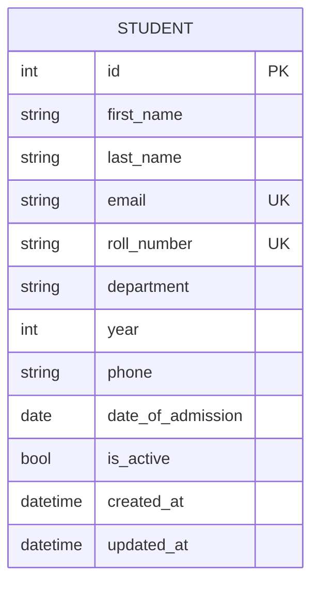

Student Management System
A complete CRUD-based full-stack web application built per the SOP for
Complete CRUD-Based Web Application Development.
Stack: React (frontend) · Django REST Framework (backend) · SQLite (database)
---
1. Project Overview
The Student Management System lets a college administrator create, view,
search/filter, update, and delete student records through a REST API and a
React single-page interface.
Problem statement: Colleges need a simple, reliable way to maintain
student records (personal details, department, year, admission date)
without spreadsheets or paper files.
Objectives:
Provide a REST API exposing full CRUD on the `Student` entity.
Provide a responsive React UI for the same operations.
Enforce validation on both client and server.
Support search and filtering (by name/email/roll number, department, year).
2. Technology Stack
Layer	Technology
Frontend	React 18, Axios
Backend	Django 5, Django REST Framework
Database	SQLite (dev) — swap to MySQL/PostgreSQL for production
API Testing	Postman (collection included) / Django `APITestCase`
Version Control	Git
3. System Architecture
```
User → React Frontend (port 3000)
        │  fetch/axios, JSON over HTTP
        ▼
     REST API (Django REST Framework, port 8000)
        │  ORM
        ▼
     SQLite Database (db.sqlite3)
```
4. Database Design (ER Diagram)

Constraints: `email` and `roll_number` are `UNIQUE`; `first_name`,
`last_name`, `department`, `year`, `date_of_admission` are `NOT NULL`.
5. Project Structure
```
studentms/
├── backend/
│   ├── manage.py
│   ├── requirements.txt
│   ├── studentms_backend/      # project settings, urls, wsgi/asgi
│   └── students/                # app: models, serializers, views, urls, admin, tests
├── frontend/
│   ├── package.json
│   ├── public/index.html
│   └── src/                     # App.js, api.js, components/
├── postman_collection.json
└── README.md  (this file)
```
6. Installation & Execution
Prerequisites
Python 3.10+
Node.js 18+ and npm
Internet access to install `pip`/`npm` packages (this project was
authored offline; you will run these steps on your own machine)
Backend setup
```bash
cd backend
python -m venv venv
source venv/bin/activate        # Windows: venv\Scripts\activate
pip install -r requirements.txt

python manage.py migrate
python manage.py createsuperuser   # optional, for /admin/
python manage.py runserver         # http://127.0.0.1:8000
```
Frontend setup
```bash
cd frontend
npm install
npm start                          # http://localhost:3000
```
The React app talks to the API at `http://127.0.0.1:8000/api` by default
(see `frontend/src/api.js`). Override with a `.env` file containing
`REACT_APP_API_URL=<your-api-url>` if needed.
Django admin
Visit `http://127.0.0.1:8000/admin/` and log in with the superuser you
created to manage students through Django's built-in admin as well.
7. REST API Reference
Base URL: `http://127.0.0.1:8000/api`
Operation	Method	Endpoint	Notes
Create	POST	`/students/`	body: student fields (JSON)
List	GET	`/students/`	supports `?search=`, `?department=`, `?year=`, `?ordering=`, pagination
Retrieve	GET	`/students/{id}/`	404 if not found
Update	PUT/PATCH	`/students/{id}/`	PATCH for partial update
Delete	DELETE	`/students/{id}/`	200 with confirmation message
Student fields: `first_name`, `last_name`, `email` (unique), `roll_number`
(unique), `department` (choice), `year` (1-4), `phone` (optional), `date_of_admission`.
Example — create a student
```bash
curl -X POST http://127.0.0.1:8000/api/students/ \
  -H "Content-Type: application/json" \
  -d '{
    "first_name": "Asha", "last_name": "Kumar",
    "email": "asha.kumar@example.com", "roll_number": "CSE2024001",
    "department": "CSE", "year": 2, "phone": "+919876543210",
    "date_of_admission": "2024-06-15"
  }'
```
Example — search
```
GET /api/students/?search=Kumar&department=CSE&year=2
```
A ready-to-import Postman collection is at `postman_collection.json`
(covers create/read/update/delete, valid + invalid + missing/duplicate/
nonexistent-ID cases).
8. Validation
Client-side: required fields, email format, phone format, checked in
`StudentForm.js` before submit.
Server-side: `StudentSerializer` validates and normalizes email/roll
number; the DB enforces `UNIQUE` on email and roll number; `StudentViewSet`
catches `IntegrityError` and returns a clear 400 message instead of a
500 crash.
9. Testing
Run the backend test suite (10 tests covering create/read/update/delete
with valid, invalid, missing, duplicate, and nonexistent-ID cases):
```bash
cd backend
python manage.py test
```
For manual/API testing, import `postman_collection.json` into Postman, or
use `curl` as shown above. For frontend testing, resize the browser to
verify responsiveness, and try disconnecting the backend to confirm the
"Could not reach the backend" error banner appears.
10. Security Notes
No secrets are hard-coded; `SECRET_KEY`, `DEBUG`, and `ALLOWED_HOSTS`
read from environment variables with safe local defaults.
CORS is restricted to the local frontend origin via `CORS_ALLOWED_ORIGINS`.
All database access goes through the Django ORM (parameterized queries).
Before deploying: set `DJANGO_DEBUG=False`, set a strong `DJANGO_SECRET_KEY`,
set `DJANGO_ALLOWED_HOSTS`, and add authentication (e.g. DRF token/session
auth) if the app will hold real student data.
11. Challenges & Solutions
Duplicate emails/roll numbers: handled with unique DB constraints +
serializer validation + a caught `IntegrityError` so the API returns a
clean 400 instead of a server error.
Frontend/backend decoupling: solved with CORS configuration and a
single `api.js` axios client so the API base URL is configurable per
environment.
12. Future Enhancements
Authentication/authorization (login, roles: admin vs staff).
Pagination controls and CSV export in the UI.
File upload for student photos/documents.
Dockerized deployment (backend + frontend + Nginx).
13. Completion Checklist
[x] Create, Read, Update, Delete all implemented (API + UI)
[x] Frontend-backend-database communication via REST/JSON
[x] Client- and server-side validation
[x] Automated backend tests + Postman collection
[x] README with setup, API docs, and architecture
